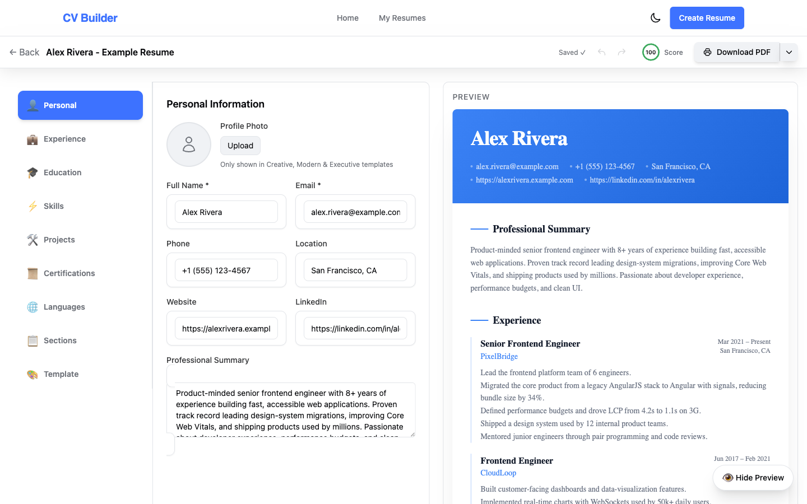
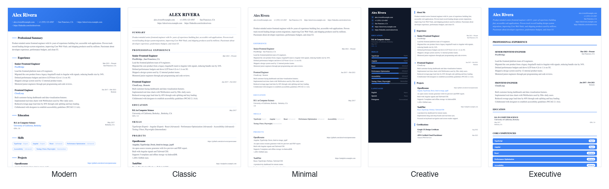
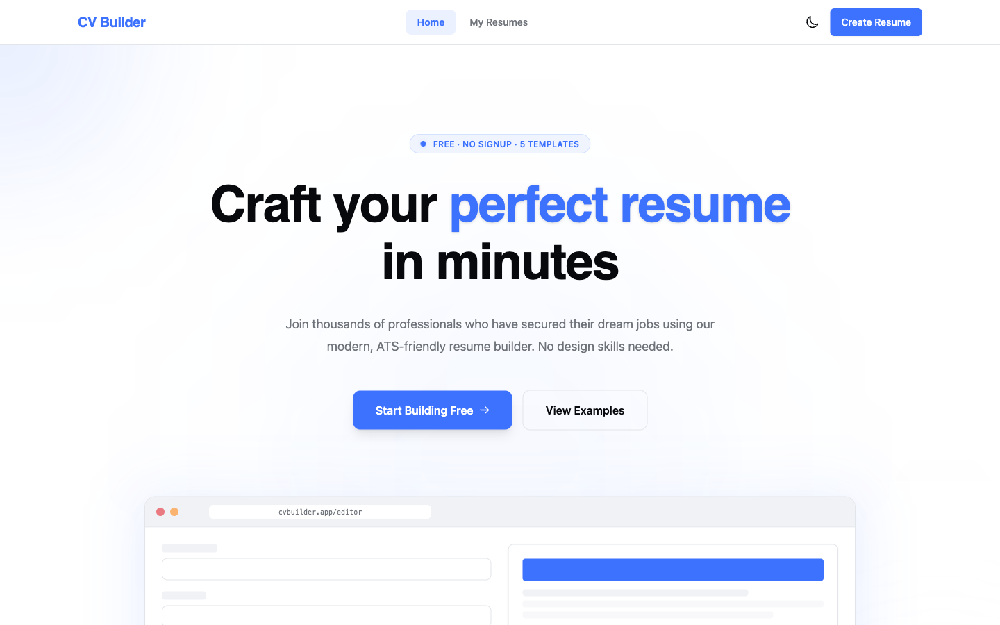
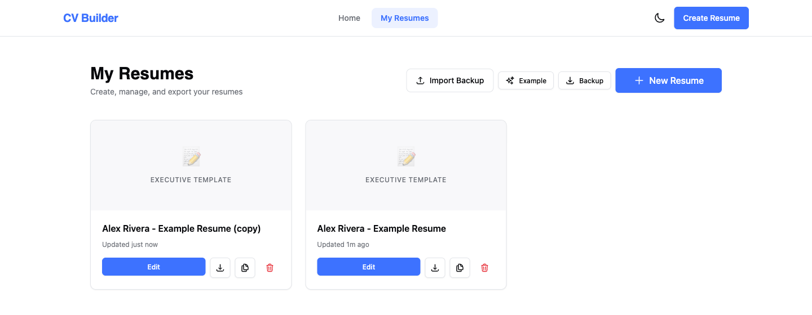
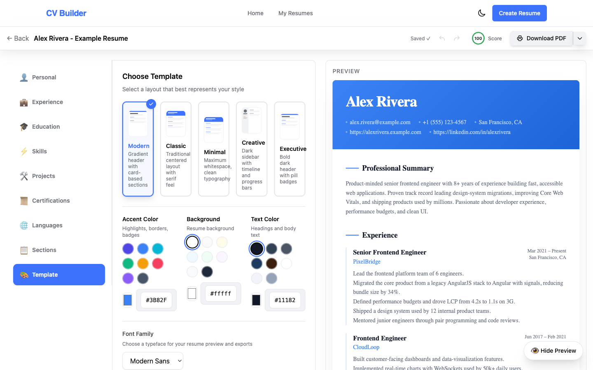
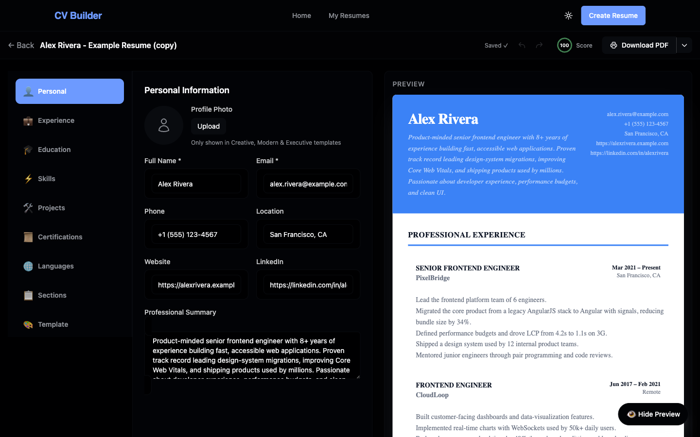
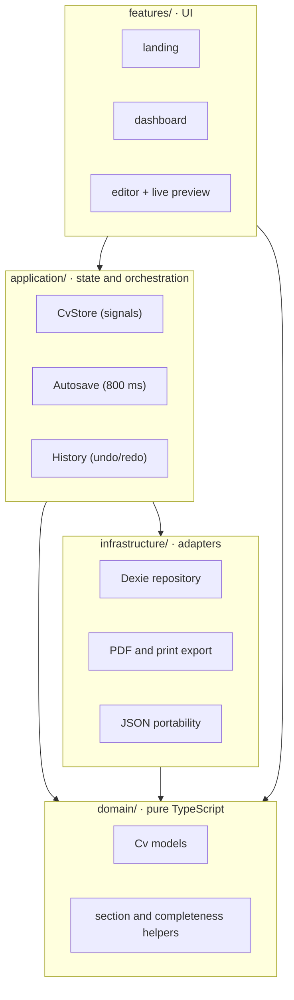
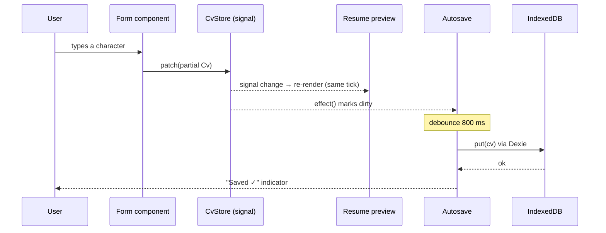

<div align="center">



# 📄 Modern CV Builder

### Build a professional résumé in your browser. No account, no tracking.

Fill structured forms, watch an A4 preview update as you type, pick one of five distinct
templates, and export a print-ready PDF. Every résumé lives in **your** browser's IndexedDB —
the only thing that ever touches a server is the optional Cloud PDF export, rendered on the
project's own Cloudflare Worker when you explicitly choose it.

<br/>

[](https://cv-builder.andersseen.dev)
[](https://github.com/Andersseen/cv-builder/actions/workflows/ci.yml)
[](https://github.com/Andersseen/cv-builder/actions/workflows/deploy.yml)
[](LICENSE)


**[Live demo](https://cv-builder.andersseen.dev)** ·
[Features](#-features) ·
[Quick start](#-quick-start) ·
[Templates](#-five-genuinely-different-templates) ·
[Architecture](#-architecture) ·
[Docs](#-documentation)

</div>

---

## 🤔 Why another résumé builder?

Most online builders ask you to sign up, keep your employment history on their servers, and put
the PDF export behind a paywall. This one inverts all three.

|                   | Typical online builder      | Modern CV Builder                   |
| ----------------- | --------------------------- | ----------------------------------- |
| **Account**       | Required                    | None — open the page and start      |
| **Your data**     | On their servers            | IndexedDB in your browser only¹     |
| **PDF export**    | Often paywalled/watermarked | Free, unlimited, three export modes |
| **Works offline** | No                          | Yes, after the first load²          |
| **Cost to host**  | —                           | $0 on Cloudflare Workers' free tier |

> ¹ The one exception: the opt-in **Cloud PDF** export sends the résumé HTML to the project's
> own Cloudflare Worker for server-side rendering — nowhere else, only when you pick it.
> ² The two client-side exports work offline; Cloud PDF needs the network.

> **Design principle:** the résumé is the product. Preview fidelity and PDF quality beat every
> app-UI concern — which is why the preview always renders on white, even in dark mode.

---

## ✨ Features

|     | Feature                     | What it does                                                                                        |
| :-: | --------------------------- | --------------------------------------------------------------------------------------------------- |
| 📝  | **Nine content tabs**       | Personal, Experience, Education, Skills, Projects, Certifications, Languages, Sections and Template |
| ⚡  | **Instant live preview**    | Zoneless signals push every keystroke straight to the A4 preview — no debounce, no lag              |
| 🎨  | **Five distinct templates** | Different _layouts_ (sidebar, header-accent, single-column), not recolours of one design            |
| 🌈  | **Per-résumé theming**      | Accent, background and text colours plus four print-safe font stacks                                |
| 🧩  | **Flexible sections**       | Reorder sections, hide the ones you don't need, add your own custom sections                        |
| 📊  | **Completeness score**      | A live 0–100 score with actionable suggestions that jump straight to the right tab                  |
| 💾  | **Autosave**                | Debounced 800 ms writes to IndexedDB — edits survive a reload or a crashed tab                      |
| ↩️  | **Undo / redo**             | In-memory history with keyboard shortcuts                                                           |
| 📤  | **Three PDF modes**         | Image PDF (pixel-perfect), print PDF (ATS-friendly text), Cloud PDF (both, server-rendered)         |
| 🔁  | **JSON portability**        | Export/import a single résumé, or back up and restore everything                                    |
| 🌗  | **Dark mode**               | System-preference aware, persisted — the résumé itself stays print-white                            |
| 🔒  | **No third-party calls**    | No analytics, no fonts CDN, no telemetry. The only API is our own Worker's `/api/pdf`               |

---

## 🎨 Five genuinely different templates

<div align="center">

</div>

| Template      | Layout                                       |
| ------------- | -------------------------------------------- |
| **Modern**    | Gradient header with card-based sections     |
| **Classic**   | Traditional centred layout with a serif feel |
| **Minimal**   | Maximum whitespace, clean typography         |
| **Creative**  | Dark sidebar with timeline and progress bars |
| **Executive** | Bold dark header with pill badges            |

Adding a sixth is a two-file change — see [docs/CONVENTIONS.md](docs/CONVENTIONS.md).

---

## 🚀 Quick start

```bash
git clone https://github.com/Andersseen/cv-builder.git
cd cv-builder
pnpm install
pnpm start          # → http://localhost:5173
```

That's it. No `.env`, no database to provision, no API keys — there is no backend to point at.

> **Requires** Node.js 22+ and [pnpm](https://pnpm.io/) 10+ (pnpm is the package manager here, not npm).

---

## 📸 Screenshots

|                                                    Landing                                                    |                                      Dashboard                                      |
| :-----------------------------------------------------------------------------------------------------------: | :---------------------------------------------------------------------------------: |
|                                                 |  |
|                                         **Template picker & theming**                                         |                                    **Dark mode**                                    |
|  |            |

---

## 🧩 Architecture

Four layers, dependencies pointing **downward only**. `domain/` is pure TypeScript — no Angular,
no RxJS, no side effects, ever.



| Layer             | Owns                                   | May depend on                             |
| ----------------- | -------------------------------------- | ----------------------------------------- |
| `features/`       | Pages and components                   | `application`, `core`, `shared`, `domain` |
| `application/`    | `CvStore`, `Autosave`, `History`       | `infrastructure`, `domain`                |
| `infrastructure/` | Dexie persistence, PDF/print, JSON I/O | `domain`                                  |
| `domain/`         | Models and pure helpers                | **nothing**                               |

<details>
<summary><b>How a keystroke reaches the screen and the disk</b></summary>

<br/>



Every CV mutation goes through `CvStore`. Components never touch Dexie and never call
`persist()` — `Autosave` owns that. See [docs/ARCHITECTURE.md](docs/ARCHITECTURE.md).

</details>

<details>
<summary><b>Why the initial bundle stays small</b></summary>

<br/>

The two heavy PDF dependencies are dynamically imported the first time you export, so they
never touch the initial load:

| Chunk            | Gzipped | Loaded              |
| ---------------- | ------- | ------------------- |
| `jspdf`          | ~118 kB | on first PDF export |
| `html2canvas`    | ~48 kB  | on first PDF export |
| `editor.page`    | ~30 kB  | on route entry      |
| `dashboard.page` | ~4 kB   | on route entry      |

All three routes are lazy — landing visitors never download the editor.

</details>

---

## 🛠️ Tech stack

| Layer          | Choice                                                     | Why                                               |
| -------------- | ---------------------------------------------------------- | ------------------------------------------------- |
| Framework      | **Angular 21**, standalone + signals                       | Zoneless change detection, no NgModules anywhere  |
| Meta-framework | **AnalogJS 2.6** + **Vite 6**                              | File-based routing, fast dev server, static build |
| Styling        | **Tailwind CSS v4**                                        | CSS-first `@theme` config, semantic HSL tokens    |
| Persistence    | **Dexie 4** over IndexedDB                                 | The only storage — CVs never leave the browser    |
| PDF export     | `html-to-image` + `jspdf`, native print, **Browser Run**   | Pixel-perfect _and_ ATS-friendly paths            |
| Language       | **TypeScript 5.9**, all strict flags                       | Plus `strictTemplates` for Angular templates      |
| Tests          | **Vitest** (75) + **Playwright** (14)                      | Unit for pure logic, e2e for the real flow        |
| Lint / format  | ESLint + angular-eslint, Prettier                          | Enforced in CI                                    |
| Hosting        | **Cloudflare Pages** + **Cloudflare Workers**              | Static app on Pages, PDF service on a Worker      |

---

## 📜 Scripts

| Command               | What it does                                                    |
| --------------------- | --------------------------------------------------------------- |
| `pnpm start`          | Dev server on `http://localhost:5173`                           |
| `pnpm dev:pages`      | Build + local Cloudflare Pages server                           |
| `pnpm dev:worker`     | Local Cloud PDF Worker server on `http://localhost:8787`         |
| `pnpm build`          | Production build → `dist/analog/public`                         |
| `pnpm preview`        | Serve the production build locally                              |
| `pnpm test`           | Unit tests (Vitest, single run)                                 |
| `pnpm test:watch`     | Unit tests in watch mode                                        |
| `pnpm e2e`            | End-to-end tests (Playwright)                                   |
| `pnpm e2e:ui`         | Playwright in UI mode                                           |
| `pnpm lint`           | ESLint over the repo                                            |
| `pnpm format`         | Prettier write                                                  |
| `pnpm deploy:prod`    | Build and deploy the Pages app + PDF Worker                     |
| `pnpm deploy:pages`   | Deploy `dist/analog/public` to Cloudflare Pages                 |
| `pnpm deploy:worker`  | Deploy the standalone Cloud PDF Worker                          |
| `pnpm deploy:preview` | Build and upload a Pages preview deployment                     |

For local Cloud PDF, run `pnpm dev:worker` in one terminal and `pnpm start` in another.
The Vite dev server intercepts `/api/pdf` before Analog's dev API router and forwards it to
the local Worker, matching the same-origin `/api/pdf` contract used in production.

---

## ☁️ Deployment

The app and service are split by responsibility:
[Cloudflare Pages](https://developers.cloudflare.com/pages/) serves the static Angular app, and
a standalone [Cloudflare Worker](https://developers.cloudflare.com/workers/) renders PDFs
server-side via [Browser Run](https://developers.cloudflare.com/browser-run/).

```bash
pnpm deploy:prod     # build + deploy Pages app + PDF Worker
```

Pages configuration lives in [wrangler.jsonc](wrangler.jsonc), with
`pages_build_output_dir: dist/analog/public`. `public/_redirects` keeps SPA deep links working,
and `public/_headers` sets cache and security headers.

The PDF service configuration lives in [worker/wrangler.jsonc](worker/wrangler.jsonc). In
production, Cloudflare should route `cv-builder.andersseen.dev/api/*` to the `cv-builder-pdf`
Worker so the browser can keep posting to `/api/pdf` on the same origin.

**Continuous deployment** — every push to `main` runs
[`ci.yml`](.github/workflows/ci.yml) (lint → test → build) and
[`deploy.yml`](.github/workflows/deploy.yml) (build → deploy). The deploy workflow needs two
repository secrets:

| Secret                  | Where to get it                                                            |
| ----------------------- | -------------------------------------------------------------------------- |
| `CLOUDFLARE_API_TOKEN`  | Cloudflare dashboard → My Profile → API Tokens → Pages + Workers deploy permissions |
| `CLOUDFLARE_ACCOUNT_ID` | Cloudflare dashboard → Workers & Pages → Account ID                        |

> **Browser Run free tier:** 10 minutes of browser time per day at $0 (a PDF takes ~2–4 s).
> Usage is visible in the Cloudflare dashboard under Compute → Browser Run.

---

## 🗂️ Project structure

```
src/
├── app/
│   ├── pages/                   # file-based routes: (home), dashboard, editor
│   ├── features/
│   │   ├── landing/             # hero, features, CTA
│   │   ├── dashboard/           # résumé cards, empty state, backup/restore
│   │   └── editor/
│   │       ├── components/      # one form per tab, toolbar, preview
│   │       └── resume-templates/# the five templates
│   ├── application/
│   │   ├── state/cv.ts          # CvStore — every mutation goes through here
│   │   └── services/            # autosave, history
│   ├── infrastructure/
│   │   ├── persistence/         # Dexie schema + repository
│   │   ├── export/              # image PDF + print PDF + cloud PDF client
│   │   └── portability/         # JSON export / import / backup
│   ├── domain/models/           # pure TS: Cv, defaults, template registry, helpers
│   ├── core/services/           # theme, toast
│   └── shared/                  # header, footer, toast UI, utils
├── styles.css                   # Tailwind v4 @theme + design tokens
└── main.ts                      # zoneless bootstrap
worker/
├── index.ts                     # Cloudflare Worker: POST /api/pdf (Browser Run)
└── wrangler.jsonc               # Worker service config + /api/* route
```

---

## 📚 Documentation

This repo is spec-driven: non-trivial features get a spec in `docs/specs/` before any code.

| Document                                     | Read it when you want to know…                      |
| -------------------------------------------- | --------------------------------------------------- |
| [AGENTS.md](AGENTS.md)                       | The house rules — start here before contributing    |
| [docs/CONTEXT.md](docs/CONTEXT.md)           | What the product is, and what it deliberately isn't |
| [docs/ARCHITECTURE.md](docs/ARCHITECTURE.md) | Layers, data flow, and where state lives            |
| [docs/CONVENTIONS.md](docs/CONVENTIONS.md)   | Code style and recipes (e.g. adding a template)     |
| [docs/STATE.md](docs/STATE.md)               | Current status, known issues, next steps            |
| [docs/ROADMAP.md](docs/ROADMAP.md)           | Where this is going                                 |
| [docs/specs/](docs/specs/)                   | The spec behind each shipped feature                |

---

## 🤝 Contributing

Issues and pull requests are welcome. Before you open a PR:

1. Read [AGENTS.md](AGENTS.md) — it documents the non-negotiables (standalone components,
   `OnPush` everywhere, signals over decorators, strict layer boundaries).
2. Keep `pnpm lint`, `pnpm test`, `pnpm e2e` and `pnpm build` green. CI runs all four.
3. For anything non-trivial, add a spec in `docs/specs/` first.

---

## 📄 License

[MIT](LICENSE) © [Andersseen](https://github.com/Andersseen)

<div align="center">
<br/>

**[cv-builder.andersseen.dev](https://cv-builder.andersseen.dev)**

<sub>Built with Angular 21, signals and a single Cloudflare Worker.</sub>

</div>
